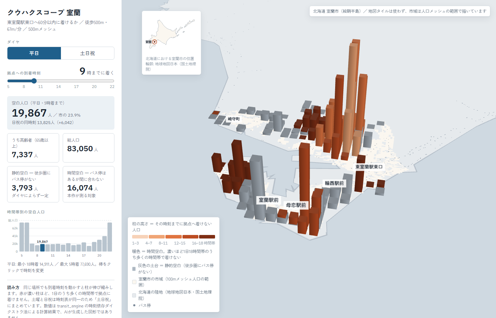

# クウハクスコープ

**バス停からの距離ではなく、時刻表で交通空白を測るツール。**
同じ地点でも時間帯・曜日で到達できるかが変わり、距離基準ではそれが見えません。
室蘭市では、休日7時に市の46.1%（38,322人）が拠点へ着けません。



## 3行でわかる特徴

| | |
|---|---|
| **診断** | 各メッシュから生活拠点に制限時間内に着けるかで空白を判定し、着けない人口を3Dマップで表示 |
| **処方** | 増便・ダイヤシフトが空白人口を何人減らすかを、費用（運行キロ）とあわせて比較 |
| **根拠** | 自作の時刻依存ダイクストラ法による決定的な計算。テスト975件 |

## 概要
少子高齢化やバス運転者不足を背景に、全国で公共交通の路線廃止・減便が進んでいます。本ツールは、GTFSオープンデータと国勢調査メッシュ人口データを組み合わせ、路線廃止・バス停削除・減便が地域のアクセシビリティに与える影響を、地図上でシミュレーション・可視化します。核心は、時刻表由来で時間帯・曜日によって変わる到達可能性の欠落＝「時間空白」を、影響人口の3Dマップとして可視化することです。「代替路線の追加」による路線再編のシミュレーションも可能です。
対象エリア：デフォルト・北海道室蘭市（道南バス）

### 他地域での動作確認

GTFSを差し替えるだけで他地域にも適用できます。**網走バス**（北海道オープンデータ）で、
コードを1行も変更せずに動作することを確認済みです。

| | 室蘭（道南バス） | 旭川（旭川電気軌道） | 網走（網走バス） |
|---|---|---|---|
| 停留所 | 2,329 | 765 | 583 |
| 便数（平日） | 806 | 589 | 137 |
| 人口 | 83,050 | 329,601 | — |
| ネットワーク構築 | 4.4秒 | 1.0秒 | 0.3秒 |
| ダイヤ種別の自動判定 | 平日/土曜/日祝 | 平日/土曜/日祝 | 平日/土曜/日祝 |
| **空白人口の算出** | ✓ | **✓** | 人口データ未取得 |

旭川市での実算出（拠点＝共栄バスセンター、60分以内）:

| 到着時刻 | 平日 | 土日祝 |
|---|---|---|
| 7時着 | 328,141人（99.6%） | 328,141人（99.6%） |
| 9時着 | 209,753人（63.6%） | 225,153人（68.3%） |
| 17時着 | 160,311人（48.6%） | 180,558人（54.8%） |
| 20時着 | 166,752人（50.6%） | 202,175人（61.3%） |

平日9時着の内訳は 静的空白88,570人 ＋ 時間空白121,183人（うち高齢者72,082人）。
11,911メッシュ×10通りの診断が0.8秒で終わります。

```bash
python tools/verify_other_region.py <GTFSを展開したフォルダ>
```

空白人口の算出は、標準地域メッシュコードから座標を復元する実装のため地域に依存しません
（室蘭は1次メッシュ6340番台、網走は6443〜6645番台で、どちらも破綻しないことを確認）。

人口メッシュは**桁数から粒度を自動判別**します。国勢調査のメッシュ統計は全国で
500mと1kmが整備されているため、GTFSが公開されている地域なら人口データを用意できます。

| 桁数 | 粒度 | 例 |
|---|---|---|
| 8桁 | 約1km（3次メッシュ） | `63403779` |
| 9桁 | 約500m（4次メッシュ） | `634037791` |
| 10桁 | 100m | `6340377901`（室蘭で使用） |

なお**網走市のメッシュ人口データは未入手**のため、他地域での空白人口の実算出は未実施です。

アプリのサイドバーからGTFS（ZIP）をアップロードして差し替えることもできます。
## 機能一覧
1. 到達圏の計算・可視化
任意の出発バス停・出発時刻・制限時間を指定すると、制限時間内に到達可能なバス停を4段階の色分けで地図上に表示します。バス停をクリックすると、乗り継ぎ経路がポップアップで表示されます。
2. 路線廃止シミュレーション（複数路線同時対応）
任意の路線を1つまたは複数同時に廃止した場合の影響を可視化します。直接乗車可能な路線と乗り換え利用路線をグループ分け表示し、高速バスは自動除外します。到達不能バス停（赤）・悪化バス停（オレンジ）・影響なしバス停（グレー）を色分けします。
3. バス停削除シミュレーション
任意のバス停を選択して削除をシミュレーションします。バス路線は削除バス停を通過扱いとし、路線自体は維持されます。徒歩圏距離を300m（都市部基準）/500m（地方部基準）から選択可能です（国交省ハンドブック基準）。
4. 減便シミュレーション
3つの減便方式から選択できます。

特定路線の便数を半分にする
特定路線の便を間引く（N本に1本残す）
全路線一律で削減（10%-80%）

5. 時間帯別到達圏アニメーション
5時から22時の全18時間帯の到達圏を一括計算し、スライダーで切り替えながら到達圏の変化を確認できます。棒グラフでサービス水準の時間変動を定量的に把握できます。
6. 人口影響分析
令和2年国勢調査の100mメッシュ人口データと統合し、「影響を受ける人口」「うち高齢者数（65歳以上）」を自動算出します。
7. 施設アクセス分析
病院・スーパー・薬局・歯科・コンビニ・郵便局の6種類の施設について、アクセス可能な施設数を算出します。歩行速度は一般（分速67m）/高齢者（分速40m）から選択可能です。シミュレーション時には廃止前後の施設アクセス比較を地図マーカー（緑/赤/グレー）で可視化します。
8. 代替路線追加シミュレーション
既存路線を廃止した上で、任意のバス停を結ぶ新規路線を追加します。運行間隔・平均速度を指定して仮想時刻表を生成します。
9. 時間空白診断（3D）
各メッシュから生活拠点に制限時間内に着けるかで空白を判定し、着けない人口を500mメッシュの3Dカラム（pydeck）で表示します。到着時刻とダイヤ（平日／土日祝）を切り替えられ、徒歩圏にバス停がない「静的空白」と、バス停はあるが間に合わない「時間空白」を区別します。Streamlit 無しで開ける単体版を docs/ にも用意しています（本README後半を参照）。
10. ダイヤ切り替え（平日／土曜／日祝）
全モードで平日・土曜・日祝のダイヤを切り替えて分析できます。交通空白は休日に深刻化するため、曜日別の比較が可能です。
11. データアップロード機能
アプリ上でGTFSデータ（ZIP）、施設データ（CSV）、人口データ（CSV）を差し替え可能です。
12. 政策文書の自動生成
処方モードの比較結果から、自治体向けの文書ドラフト（Markdown）を生成します。診断結果・比較した施策・推奨とその根拠・前提条件・データ出典を含みます。**数値はすべてアプリ側で決定的に算出しており、生成AIは使いません。** 任意で自分のAnthropic APIキーを入力すると文章の推敲にClaudeを使えますが、その場合も「下書きに無い数値が増えていないか」を機械的に照合して表示します（キーは保存しません）。
## 技術スタック
要素技術言語Python 3.12WebフレームワークStreamlit地図可視化Folium + streamlit-folium（2D）／ pydeck・deck.gl（3Dカラム）グラフ探索時刻依存ダイクストラ法（自作実装）数値処理pandas・numpyデータソースGTFS-JP（道南バス）、令和2年国勢調査100mメッシュ人口デプロイStreamlit Community Cloud
## アルゴリズムの詳細
時刻依存ダイクストラ法
通常のダイクストラ法と異なり、エッジのコストが到着時刻によって変化します。8:15に東室蘭駅に着けば8:20発のバスに乗れる（待ち5分）が、8:25に着いたら次の9:00発まで待つ必要がある（待ち35分）。この時刻依存性により、出発時刻によって到達圏が大きく変化することを正確にシミュレーションできます。
ネットワーク構成

バスエッジ: GTFSのstop_times.txtから同一便内の連続停車をエッジとして生成（出発時刻・到着時刻付き）
徒歩エッジ: 300m以内のバス停間にHaversine距離ベースで生成（歩行速度67m/分）
平日ダイヤ: calendar.txtに基づき平日運行の便のみを抽出

バス停削除の通過扱いロジック
削除バス停を含む便の前後バス停を直通エッジで接続。削除バス停と徒歩エッジで接続されていた近隣バス停同士を新たに徒歩エッジで直接接続。バスエッジのみの接続には新規徒歩エッジを追加しない（意図しない新規接続を防止）。
路線再編のモデル化
代替路線は「指定バス停を結ぶ新規バスエッジを時刻表付きで生成」する形で実装。
## 分析から得られた知見
（いずれも修正後ネットワーク・平日ダイヤ、室蘭駅前を起点、制限60分での実測値）

時間帯格差: 室蘭駅前から60分以内の到達可能バス停数は5時台11箇所vs10時台304箇所（27.6倍）。時刻表由来の「時間空白」が距離では見えないことを示す本ツールの核心。
曜日格差: 東室蘭駅東口へ60分以内に着けない人口は、平日7時着で25.5%に対し休日7時着では46.1%（市の約半分）。休日朝の交通空白は平日より深刻。
路線廃止の非対称性: 全102路線中、廃止で到達不能を生むのは5路線のみ（最大は「みたら・東室蘭駅東口線」で72箇所）。
減便の影響: 全路線一律で30%削減すると到達不能76箇所、40%で109箇所、50%で144箇所と段階的に悪化。
ネットワークの冗長性: 東室蘭駅東口のような主要停留所を削除しても到達不能はその停留所自身のみ（西口経由で東側は到達可能）。単一バス停より路線・減便の影響が大きい。

## 使用データと出典

| データ | 出典 | ライセンス |
|---|---|---|
| バス時刻表（GTFS-JP） | 道南バス株式会社（2026年4月1日改正ダイヤ） | [ODPT基本ライセンス](https://developer.odpt.org/terms/data_basic_license.html) |
| 100mメッシュ人口 | 令和2年国勢調査をもとにした[簡易100mメッシュ人口](https://gtfs-gis.jp/teikyo/) | CC BY |
| 北海道の海岸線 | [地球地図日本](https://www.gsi.go.jp/kankyochiri/gm_jpn.html)（国土地理院） | 国土地理院コンテンツ利用規約 |
| 徒歩圏距離の基準 | 国土交通省「都市構造の評価に関するハンドブック」（2014年） | ― |
| 施設POI（医療142件・学校） | [国土数値情報 医療機関（P04）](https://nlftp.mlit.go.jp/ksj/gml/datalist/KsjTmplt-P04-v3_0.html)・[学校（P29）](https://nlftp.mlit.go.jp/ksj/gml/datalist/KsjTmplt-P29-v2_1.html)（国土交通省） | 国土数値情報利用約款 |

> 施設データは `python tools/build_facilities.py` で再生成できます。学校の分類コードは
> 公開メタデータに定義が無いため、北海道全2,824件の名称から実証して対応付けています
> （`tools/verify_school_codes.py`）。福祉施設（P14）は室蘭市のデータが存在しないため未収録です。
> アプリのサイドバーから任意の施設CSVを読み込むこともできます。

## プロジェクト構成
transit-accessibility/
├── app.py                    # Streamlitアプリ本体（10モード）
├── transit_engine.py         # 計算エンジン（時刻依存ダイクストラ法）
├── blank_area.py             # 時間空白の診断（空白人口の算出）
├── prescription.py           # 処方（増便・ダイヤシフトの効果比較）
├── policy_report.py          # 政策文書の生成（数値は決定的・AI整形は任意）
├── session_data.py           # 訪問者ごとのアップロード処理（共有ファイルに書かない）
├── service_calendar.py       # ダイヤ種別（平日/土曜/日祝）の判定
├── population.py             # 人口データ・施設データ管理
├── build_network.py          # GTFSからネットワーク構築
├── bus_edges.csv             # 全ダイヤ分のバスエッジ（115,406行）
├── walk_edges.csv            # 停留所間300m以内の徒歩エッジ
├── facilities.csv
├── 100m_mesh_pop2020_01205室蘭市.csv
├── test_all.py / _v2 / _v3   # 自動テスト（472 / 137 / 535件）
├── test_blank_area.py        # 自動テスト（34件）
├── test_day_type.py          # 自動テスト（19件）
├── test_scenario.py          # 自動テスト（17件）
├── test_prescription.py      # 自動テスト（25件）
├── test_policy_report.py     # 自動テスト（49件）
├── test_session_isolation.py # 自動テスト（25件）
├── docs/                     # 3Dマップ・技術仕様書・進捗報告
├── tools/                    # 3Dマップの生成スクリプト
├── gtfs_data/
└── requirements.txt

## テストで検証している主な不変条件（合計1,313件）
・単調性：便を増やせば到達範囲は広がる（土曜+平日 ⊇ 各々）。減便率を上げれば空白は増える
・一致性：改変後エッジを返す関数と、従来のシミュレーション関数の結果が一致する
・保存則：500mメッシュへの集約で総人口・空白人口が保存される
・費用中立：ダイヤシフトで総便数・総運行キロが変わらない
・訪問者の分離：公開環境で1人がダイヤ切替・処方計算・GTFSアップロードをしても、他の訪問者の結果は変わらない（共有エンジンのままだと、処方計算中の別訪問者に平日9時の空白人口が19,867人ではなく77,690人と表示されていた）
・文書の再現性：政策文書はAPIキー無しで必ず生成され、記載の数値は画面の計算結果と一致する。AIで推敲した場合も、下書きに無い数値が混入すれば検出される
・データ整合性（エッジの移動時間が非負、自己ループなし）、到達圏の時間制約

## セットアップ

```bash
git clone https://github.com/K-hskw/transit-accessibility.git
cd transit-accessibility
python -m venv venv
.\venv\Scripts\Activate.ps1      # Windows PowerShell
pip install -r requirements.txt
streamlit run app.py
```

bus_edges.csv と walk_edges.csv はリポジトリに含まれているため、
`python build_network.py` の実行は不要です（GTFSを差し替えたときのみ）。

## ドキュメント
・[技術仕様書](docs/) — 設計判断、アルゴリズム、既知の限界をまとめたもの
・[進捗報告](docs/) — 修正した計算バグと、更新した分析結果の対照表

## 時間空白の3Dマップ（docs/）
「時間空白診断（3D）」モードと同じ計算結果を、Streamlit 無しで開ける1枚の
HTMLとして docs/kuhaku-scope-muroran.html に置いています。各メッシュから
生活拠点（既定：東室蘭駅東口）に制限時間内に着けない人口を、500mメッシュの
3Dカラムで表示し、到着時刻とダイヤ（平日／土日祝）を切り替えられます。
灰色の土台が静的空白（徒歩圏にバス停がない）、暖色の柱が時間空白（バス停は
あるが時刻表の都合で間に合わない）です。

### 再生成
```bash
python tools/build_map3d.py
```
外部依存は deck.gl（jsdelivr）と Google Fonts のみで、生成後はブラウザで
直接開けます（地図タイルは使いません）。

---

開発者：K-hskw 
